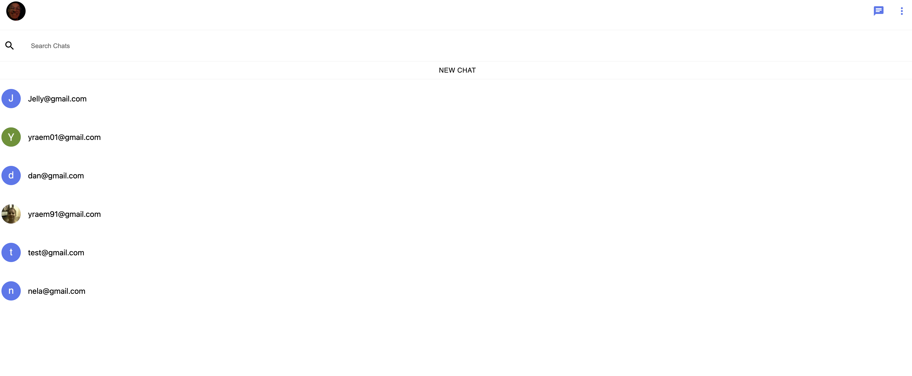
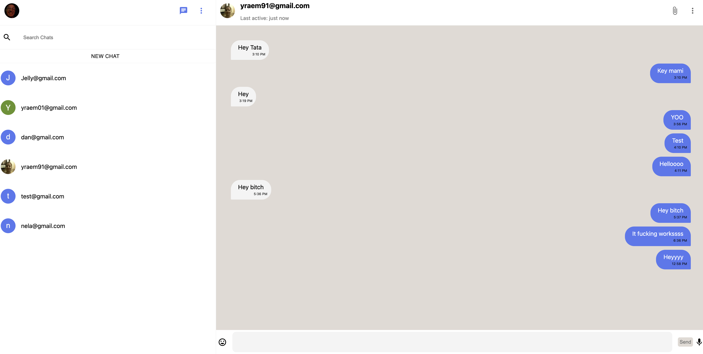
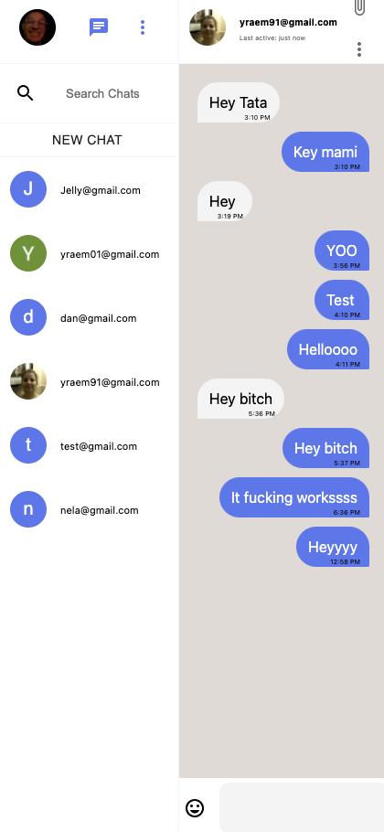

# Hermes
  

  # Live Site
  [Link](https://hermes-nine.vercel.app/)
  
  # Table of Contents 
  * [Installation](#Installation) 
  * [Usage](#Usage) 
  * [License](#license)
  * [Contributing](#Contribute) 
  * [Testing](#Testing)
  * [Questions](#Questions)
  
  # Description 
A live 1 to 1 messaging app! Log in with Google Authentication and send me a message at my email cuba289@gmail.com. I plan on upgrading the UI for mobile and add the ability to create groups and possibly channels.

</img>
</img>
</img>
  
  # Installation
   **yarn install**

  # Contribute
  **Create pull request**

  # Usage
  **git clone**

  # Questions
  If you had any questions feel free to contact my email cuba289@gmail.com

  To see more of my work visit me here [Arecio3](https://github.com/Arecio3)

  # License
  

